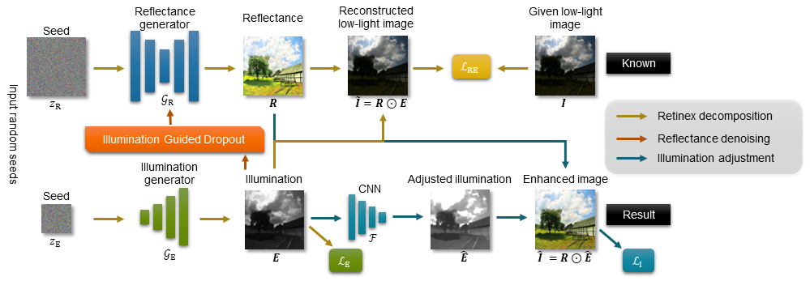

# Discrepant Untrained Network Priors

Official PyTorch implementation of the
paper [
[IEEE TCSVT'22] Self-Supervised Low-Light Image Enhancement Using Discrepant Untrained Network Priors
](https://ieeexplore.ieee.org/document/9792425/).

----------

----------

## Get Started

### Dependencies and Installation


1. Create conda environment

```
conda create --name drp python=3.6
conda activate drp
```

2. Clone repo

```
git clone https://github.com/sherrycattt/discrepant-untrained-nn-priors.git
```
3. Install dependencies

```
cd discrepant-untrained-nn-priors
pip install -r requirements.txt
```

### Run

Specify the input path ```input_path```, the output directory ```output_dir```, and other hyper-parameters. Then run

```bash
CUDA_VISIBLE_DEVICES=0 python main.py --input_path images/input2.png --output_dir output --num_iter 15000 --show_every 1000 --drop_tau 0.1  
```

## Citation

If you find our work useful in your research or publication, please cite it:

```
@Article{liang2022selfsupervised,
  author  = {Liang, Jinxiu and Xu, Yong and Quan, Yuhui and Shi, Boxin and Ji, Hui},
  title   = {Self-Supervised Low-Light Image Enhancement Using Discrepant Untrained Network Priors},
  journal = {IEEE Transactions on Circuits and Systems for Video Technology},
  year    = {2022},
  pages   = {Early Access},
  issn    = {1558-2205},
  doi     = {10.1109/TCSVT.2022.3181781},
}
```

----------

## Further comments

The code is heavily borrowed from [DoubleDIP](https://github.com/yossigandelsman/DoubleDIP).

The code is provided as-is for academic use only and without any guarantees. Please
contact [the author](mailto:cssherryliang@pku.edu.cn) to report any bugs. 